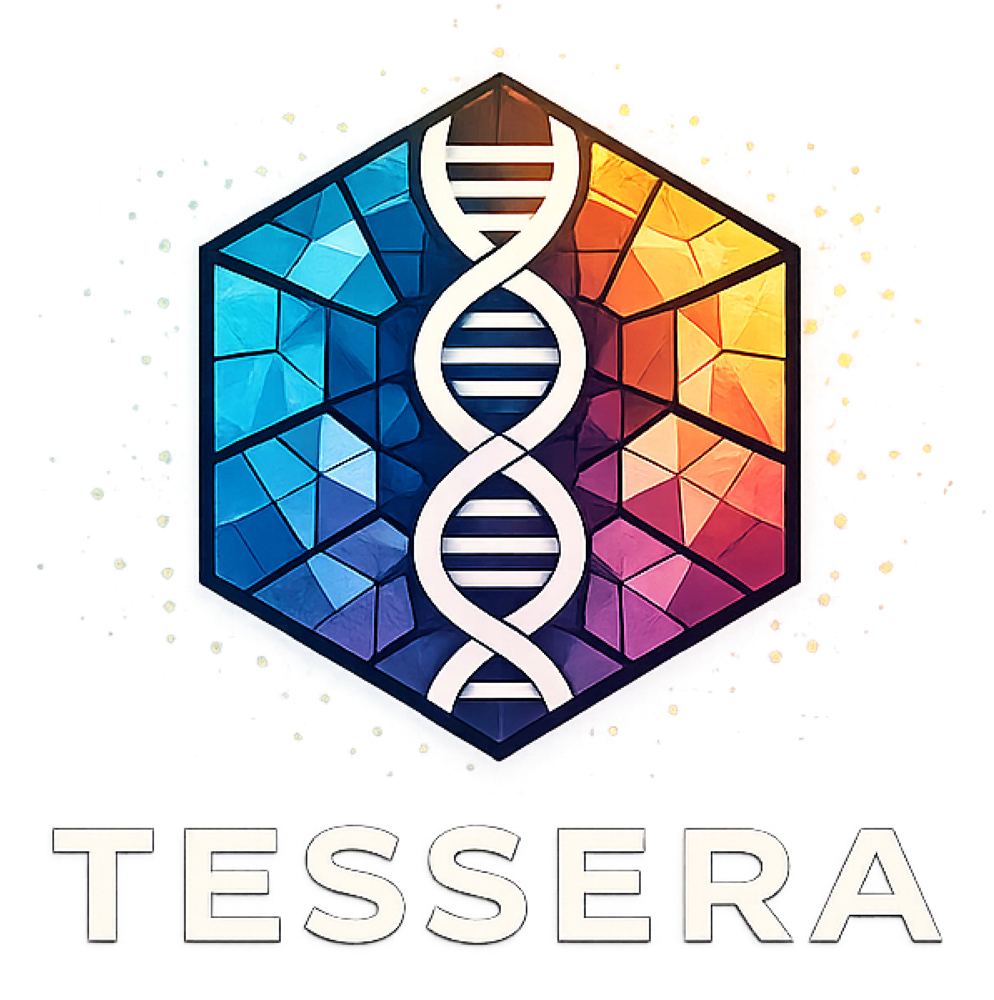

<p align="center">
  
</p>

<p align="center">
  <em>Tumour Embeddings via Self-Supervised Encoding and Reconstruction of Alterations</em><br>
  A foundation model for the cancer genome.
</p>

---

TESSERA is a self-supervised foundation model jointly pretrained on somatic single-nucleotide variants (SNVs) and copy-number alterations (CNAs) from the TCGA Pan-Cancer Atlas. A single learned representation, produced once and reused without retraining, supports variant pathogenicity prediction, pan-cancer tumour-type classification, unsupervised molecular subtyping, prognostic stratification, and counterfactual treatment-effect estimation.

This repository contains the reference implementation, the pretrained-weights pointer, the inference utilities described in the accompanying paper, and the end-to-end analysis pipelines that reproduce every panel of Figures 1-6 and Supplementary Figures 1-12.

## Quick start

The fastest way to use TESSERA is via the public inference API on Hugging Face; no local installation required. Upload SNV and/or CNA data, get back per-variant predictions and embeddings:

🔗 **Inference API**: [huggingface.co/spaces/JW-Sidhom-Lab/tessera](https://huggingface.co/spaces/JW-Sidhom-Lab/tessera) *(coming soon)*

From Python:

```python
from gradio_client import Client

client = Client("JW-Sidhom-Lab/tessera")
result = client.predict(
    maf_file="path/to/sample.maf",
    seg_file="path/to/sample_segments.tsv",
    api_name="/predict",
)
# result includes per-variant embeddings, pathogenicity scores,
# per-segment predictions, and a sample-level joint embedding.
```

The API serves the foundation-model outputs only (embeddings + per-variant / per-segment predictions). Downstream task heads (tumour-type classifier, treatment-effect score) are available on request under a Data Use Agreement.

## Local installation

For users who want to run inference offline, integrate TESSERA into a custom pipeline, or retrain on their own data:

```bash
# Clone
git clone https://github.com/JW-Sidhom-Lab/tessera.git
cd tessera

# Recommended: a virtual environment so deps don't clash with system Python
python3 -m venv .venv && source .venv/bin/activate

# Install all dependencies
pip install -r requirements.txt

# Download reference genome (default: GRCh37)
bash tessera/ref_genomes/download_ref_genomes.sh
```

`requirements.txt` covers the foundation-model package, all manuscript-reproduction scripts (pretraining, classifiers, prognostic / predictive-biomarker analyses), and the Gradio inference API. A trimmer subset for deploying only the inference API is at [`inference_api/requirements.txt`](inference_api/requirements.txt).

Weights are hosted on Hugging Face Hub at [huggingface.co/JW-Sidhom-Lab/tessera-foundation](https://huggingface.co/JW-Sidhom-Lab/tessera-foundation) *(coming soon)*. Loading from Python:

```python
from tessera.model import TESSERA
from huggingface_hub import snapshot_download

weights_dir = snapshot_download(repo_id="JW-Sidhom-Lab/tessera-foundation")
model = TESSERA(name="tessera_v1", model_dir=weights_dir)
```

## Reproducing the manuscript

Every published panel is backed by a script in this repository. The
pipeline runs in three stages:

1. **Data preparation** ([`data/`](data/README.md)): per-cohort
   download instructions, source-table provenance, and the
   `create_training_data*.py` / `build_<cohort>_metadata.py` builders
   that turn raw releases into the analysis-ready CSVs.
2. **Foundation-model pretraining**
   ([`scripts/tcga_pancan_*/`](scripts/README.md)): trains the SNV
   models, the CNA models, and the joint SNV+CNA InfoNCE-aligned
   foundation model on the TCGA Pan-Cancer Atlas.
3. **Downstream analyses** ([`scripts/`](scripts/README.md)):
   variant-pathogenicity (Fig. 1 h-o), cross-platform validation
   (Fig. 1 f-g, Fig. 2 d), tumour-type classification (Fig. 3,
   Fig. 4 b-e), prognostic UMAP + joint Cox (Fig. 5), doubly-robust
   counterfactual treatment-effect (Fig. 6 a-m), and DepMap
   cell-line transfer (Fig. 6 n).

[`scripts/README.md`](scripts/README.md) and
[`data/README.md`](data/README.md) hold the full per-directory tables
mapping each script and cohort to its manuscript figure.

## Repository layout

```
tessera/
├── tessera/                        # foundation-model package
│   ├── base.py                     # BaseModel: shared data + training infrastructure
│   ├── input_keys.py               # input-key helpers
│   ├── model.py                    # TESSERA: foundation-model class
│   ├── data/
│   │   └── preprocessing.py        # SNV/CNA tokenization, FASTA lookup, sample bagging
│   ├── layers/                     # custom Keras layers (attention, masking, MIL, ...)
│   ├── training/                   # training utilities (callbacks, losses, schedules)
│   └── ref_genomes/                # reference-genome download script + indices
├── data/                           # per-cohort data preparation pipelines (data/README.md)
├── scripts/                        # analysis pipelines backing the manuscript figures (scripts/README.md)
└── README.md
```

## Citing TESSERA

If you use TESSERA in your work, please cite:

> *citation pending publication*

A BibTeX entry will be added on acceptance.

## License

This repository is currently distributed under the **Apache License 2.0** (see [`LICENSE`](LICENSE)). License terms are subject to confirmation by Cornell's Center for Technology Licensing in light of pending patent applications covering specific clinical applications. Pretrained weights for downstream task heads (CRC and PDAC treatment-effect models) are available on request under a Data Use Agreement.

## Lab

TESSERA is developed in the [JW Sidhom Lab](https://github.com/JW-Sidhom-Lab) at Weill Cornell Medicine.

For questions, collaborations, or commercial-licensing enquiries, contact the corresponding author.
